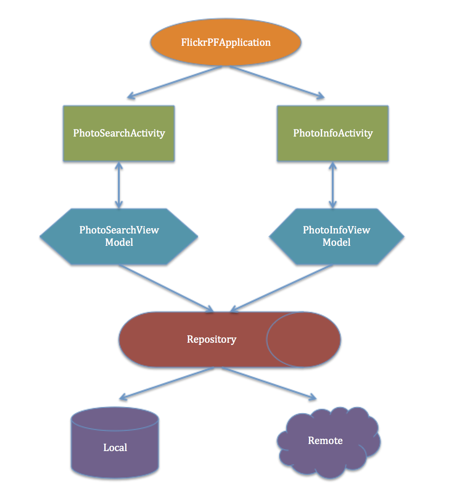

# FlickrPublicFeed
This project is an Android App which makes use of flickr photo search API to get the photos and allows the user to navigate through them.

**Approach**

Following key points have been considered –
•	Architecture - MVVM
•	Dependency Injection
•	Material Design
•	Libraries

**MVVM Architecture**  

The project is logically divided into three modules.  Model, View and ViewModel.  

**Model** - The classes in the “repository” package represents the model and its helper classes to retrieve the model.  Here data is the content retrieved from the API.  

**View** – All the classes in the “ui” package.  These are basically Activity, Adapter & Listener classes which deals with showing the data on UI.

**ViewModel** -  The classes in the “viewmodel” package are those classes which deals with the logic of retrieving the data and handing over to the registered view.  It encapsulates the details of how to retrieve the data and helps the view to focus on showing the data.

With MVVM the code is structured, modularised and readable.

**Dependency Injection** 

The dependency injection allows the inversion of dependency.  It allow loose coupling and plugable component approach.  DI in this project has been used to inject various moduels like Application, Activity, PhotoSearch, PhotoInfo & RemoteClient with their scopes.

**Material Design**

The project has a little UI.  Only list and detail screen.  But the escense of material design has been incorporated in those two screen.  Example being card view look in the list and color theme.  
Libraries – 

Couple of well adapted libraries has been used in this project.  
•	Dagger2
•	Retrofit2
•	RxJava2
•	Gson
•	Picasso
•	ButterKnife

**Dagger2** – One of the best in practice currently for dependency injecction has been used to inject presenter to the activity.

**Retrofit2** – One of the well known network library, used to retrieve response for the given APIs

**RxJava2** – One of the well known reactive library, used to subscribe and observe the behaviour.

**Gson** – Used to convert the json response to Java object.

**Picasso** – Used to retrieve & load the photos on ImageView.

**ButterKnife** – Used to bind android views and reduce the boiler place code.

 

**APP ARCHITECTURE FLOW - HIGH LEVEL**

